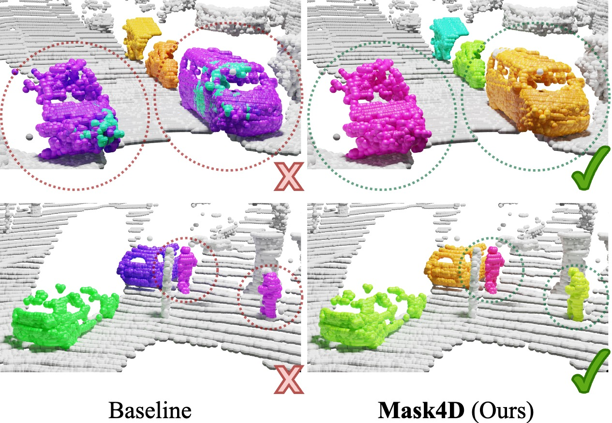

# Mask4Former: Mask Transformer for 4D Panoptic Segmentation (Renamed from MASK4D)
<div align="center">
<a href="https://github.com/YilmazKadir/">Kadir Yilmaz</a>, 
<a href="https://jonasschult.github.io/">Jonas Schult</a>,
<a href="https://nekrasov.dev/">Alexey Nekrasov</a>, 
<a href="https://www.vision.rwth-aachen.de/person/1/">Bastian Leibe</a>

RWTH Aachen University

Mask4Former is a transformer-based model for 4D Panoptic Segmentation, achieving a new state-of-the-art performance on the SemanticKITTI test set.

<a href="https://pytorch.org/get-started/locally/"></a>
<a href="https://pytorchlightning.ai/"></a>
<a href="https://hydra.cc/"></a>
<a href="https://black.readthedocs.io/en/stable/"></a>



</div>
<br><br>

[[Project Webpage](https://vision.rwth-aachen.de/Mask4Former)] [[arXiv](https://arxiv.org/abs/2309.16133)]

## News
* **2023-01-29**: Mask4Former accepted to ICRA 2024

* **2023-09-28**: Mask4Former on arXiv

### Dependencies
The main dependencies of the project are the following:
```yaml
python: 3.8
cuda: 11.7
```
You can set up a conda environment as follows
```
conda create --name mask4former python=3.8 pip==24.0 wheel==0.43.0 setuptools==69.2.0
conda activate mask4former

pip install torch==1.13.0+cu117 torchvision==0.14.0+cu117 --extra-index-url https://download.pytorch.org/whl/cu117

pip install -r requirements.txt --no-deps

pip install git+https://github.com/NVIDIA/MinkowskiEngine.git -v --no-deps

pip install git+https://github.com/facebookresearch/pytorch3d.git@v0.7.5 --no-deps

```

### Data preprocessing
After installing the dependencies, we preprocess the SemanticKITTI dataset.

```
python -m datasets.preprocessing.semantic_kitti_preprocessing preprocess \
--data_dir "PATH_TO_RAW_SEMKITTI_DATASET" \
--save_dir "data/semantic_kitti"

python -m datasets.preprocessing.semantic_kitti_preprocessing make_instance_database \
--data_dir "PATH_TO_RAW_SEMKITTI_DATASET" \
--save_dir "data/semantic_kitti"
```

### Training and testing
Train Mask4Former:
```bash
python main_panoptic.py
```

In the simplest case the inference command looks as follows:
```bash
python main_panoptic.py \
general.mode="validate" \
general.ckpt_path='PATH_TO_CHECKPOINT.ckpt'
```

Or you can use DBSCAN to boost the scores even further:
```bash
python main_panoptic.py \
general.mode="validate" \
general.ckpt_path='PATH_TO_CHECKPOINT.ckpt' \
general.dbscan_eps=1.0
```
## Trained checkpoint
[Mask4Former](https://omnomnom.vision.rwth-aachen.de/data/mask4former/mask4former.ckpt)

The provided model, trained after the submission, achieves 71.1 LSTQ without DBSCAN and 71.5 with DBSCAN post-processing.

## BibTeX
```
@inproceedings{yilmaz24mask4former,
  title     = {{Mask4Former: Mask Transformer for 4D Panoptic Segmentation}},
  author    = {Yilmaz, Kadir and Schult, Jonas and Nekrasov, Alexey and Leibe, Bastian},
  booktitle = {{International Conference on Robotics and Automation (ICRA)}},
  year      = {2024}
}
```
